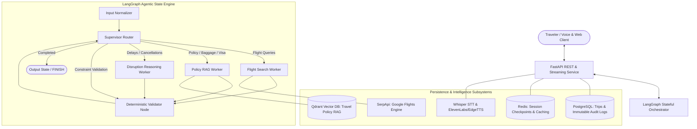

# ZICO: Intelligent Travel Operations System

ZICO (**Speak. Plan. Go.**) is a voice-first, context-aware AI travel operations companion designed to manage the entire lifecycle of a journey. Unlike traditional chatbots that provide static recommendations, ZICO maintains a persistent state of the traveler’s itinerary, enabling proactive disruption management, real-time constraint reasoning, grounded policy retrieval, and automated recovery strategies with Human-in-the-Loop verification.

---

## System Architecture



---

## Phase 1 Capabilities

### 1. Multi-Agent Orchestration (LangGraph Engine)
- **Supervisor Routing**: Dynamically classifies traveler intent and delegates to specialized workers (`flight_search_worker`, `policy_rag_worker`, `disruption_worker`, `validator_node`).
- **Flight Search Worker**: Integrates with SerpApi Google Flights to query live flight schedules, airlines, prices, and layover durations with typed `FlightOption` Pydantic models.
- **Deterministic Validation**: Validates itinerary temporal consistency, connection buffer deficits (e.g. min 90m layovers), and overall budget caps without LLM hallucinations.

### 2. Contextual Policy RAG Subsystem
- **Vector Search with Qdrant**: Vectorizes and semantic searches airline cancellation regulations, baggage dimension limits, and compensation rights.
- **Baseline Seeded Travel Policies**:
  - **EU Regulation 261/2004**: Delay & cancellation compensation tiers (€250-€600) and duty-of-care provisions.
  - **US DOT 24-Hour Rule**: 100% full refund rights for cancellations within 24 hours of booking.
  - **IATA Baggage Standards**: Carry-on (7kg) and checked luggage (23kg) limits and excess baggage fees.
  - **Schengen Visa & Passport Validity**: 6-month passport validity rules and 90/180-day stay limits.
  - **Travel Insurance Coverage**: Trip interruption reimbursement and 24/7 medical assistance rules.

### 3. Disruption Reasoning & Human-in-the-Loop (HITL) Controls
- **Ripple Effect Analyzer**: Detects flight delays or cancellations and computes cascading impacts on downstream connecting flights, transfers, and hotels.
- **Pending Action Proposals**: Generates structured `PendingAction` models with `requires_explicit_approval=True`.
- **Immutable Audit Trail**: Logs every traveler decision (`APPROVE` / `REJECT`) with timestamp and payload in PostgreSQL `audit_logs`.

### 4. Voice Subsystem
- **Speech-to-Text (STT)**: OpenAI Whisper audio transcription pipeline.
- **Text-to-Speech (TTS)**: EdgeTTS and ElevenLabs neural speech synthesis with WAV streaming.

### 5. FastAPI REST API Endpoints

| Endpoint | Method | Description |
|---|---|---|
| `/api/v1/health` | `GET` | Readiness check for PostgreSQL, Redis, and Qdrant |
| `/api/v1/chat` | `POST` | Stateful conversation execution via LangGraph |
| `/api/v1/trips` | `POST`, `GET` | Create, list, and fetch trip states |
| `/api/v1/trips/{trip_id}` | `GET`, `PUT` | Retrieve or update itinerary state and constraints |
| `/api/v1/actions/{action_id}/approve` | `POST` | Approve HITL recovery action and update itinerary |
| `/api/v1/actions/{action_id}/reject` | `POST` | Reject HITL recovery action with audit log entry |
| `/api/v1/flights/search` | `POST` | Query live flight options via SerpApi |
| `/api/v1/rag/query` | `POST` | Semantic search across travel policy documents |
| `/api/v1/rag/index` | `POST` | Index custom travel policy documents into Qdrant |
| `/api/v1/voice/transcribe` | `POST` | Audio file upload transcription (STT) |
| `/api/v1/voice/synthesize` | `POST` | Text-to-speech audio streaming (TTS) |

---

## Getting Started

### Prerequisites
- Docker and Docker Compose
- Python 3.12+ / Python 3.14+
- Node.js 20+

### Installation & Quickstart

1. **Clone the repository**:
   ```bash
   git clone https://github.com/sreeram0343/zico.git
   cd zico
   ```

2. **Start Infrastructure Services**:
   ```bash
   docker-compose up -d
   ```

3. **Install Backend Dependencies & Run**:
   ```bash
   cd backend
   pip install -r requirements.txt
   uvicorn app.main:app --reload --port 8000
   ```

4. **Access Interactive API Docs**:
   - Swagger UI: [http://localhost:8000/api/v1/docs](http://localhost:8000/api/v1/docs)
   - ReDoc: [http://localhost:8000/api/v1/redoc](http://localhost:8000/api/v1/redoc)

---

## Running Automated Tests

Run the complete 48-test test suite across state models, workers, validators, disruption engine, policy RAG, voice pipeline, and REST API:

```bash
# From repository root
pytest -v
```

---

## License

This project is licensed under the MIT License. See the [LICENSE](LICENSE) file for details.
